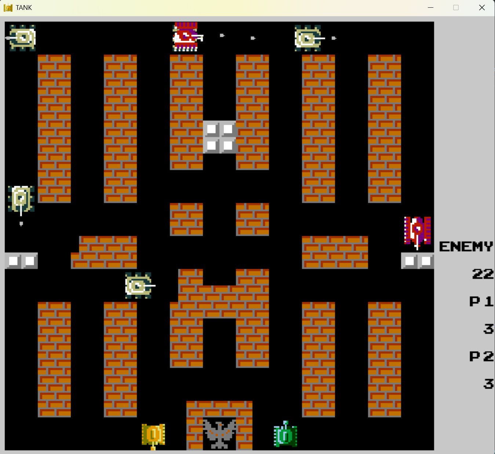

# Tank Battle Game Based on Pygame



## Project Introduction

Tank Battle is a classic 2D shooting game developed using Python and Pygame library. Players control tanks to eliminate enemy tanks on the battlefield while protecting the base and completing level challenges. This project includes complete game logic, collision detection, AI enemies, and level design, suitable for Python beginners to learn game development.

### Core Features

- Player tank movement and shooting system
- Enemy AI tank pathfinding and attack
- Multiple map elements (brick walls, steel walls, rivers, base)
- Item system (shields, bombs, upgrades, etc.)
- Level progression and score statistics
- Collision detection and physics system
- Support for two-player mode
- Editable maps

## Runtime Environment

- Python 3.7+
- Pygame 2.0+

## Quick Start

### Install Dependencies

pygame: Main engine.

csv: Read map files to compile maps.

```bash
pip install pygame
pip install csv
```

### Run the Game

Open the project with VSCode, install dependencies, and run src/main.py.

You can also double-click the packaged program tank_war.exe to run directly, which depends on resource files.

### Game Controls

menu
|                       |                  |
| --------------------- | ---------------- |
| Select | up, down |
|  Confirm       | ENTER |

Default Controls

|          | Player 1         | Player 2             |
| -------- | ---------------- | -------------------- |
| Movement | WASD             | Arrow Keys           |
| Shooting | `space`, single `C` | `num_0`, single `num_1` |

Or modify in settings.py

edit map
|                       |                  |
| --------------------- | ---------------- |
| place selected object | mouse_right_down |
| select object         | mouse_right_down |
| non select            | mouse_left_down  |
| confirm and exit      | 'ESC'            |

### Edit and Add Maps

Map files are in the `level` folder, each level is saved in `level{current level}.csv` file, containing all elements within a 13x13 range. You can add or modify them yourself. The corresponding game elements are shown in the table below:

| CSV Value | Corresponding Element |
| --------- | --------------------- |
| B         | Full brick block      |
| BU        | Upper half brick block |
| BD        | Lower half brick block |
| BL        | Left half brick block |
| BR        | Right half brick block |
| S         | Full stone block      |
| SU        | Upper half stone block |
| SD        | Lower half stone block |
| SL        | Left half stone block |
| SR        | Right half stone block |
| W         | Water tile            |
| F         | Forest tile           |

## Project Structure

```
tank-battle/
├── font/                    # Font files
├── image/                   # Image resource files
├── level/                   # Level map data
├── sound/                   # Sound files
├── src/                     # Source code
│   ├── awards.py            # Award generation
│   ├── brick_logo.py        # Brick logo
│   ├── draws.py             # Data drawing
│   ├── edit_map.py          # Map editor
│   ├── effects.py           # Special effects
│   ├── enemies.py           # Enemies and enemy AI
│   ├── game.py              # Main game loop
│   ├── game_time_manager.py # Game time management
│   ├── generateMap.py       # Read CSV to generate map
│   ├── main.py              # Game entry point
│   ├── menu.py              # Game menu
│   ├── objects.py           # Other sprite classes
│   ├── player.py            # Player and bullet sprite classes
│   ├── settings.py          # Configuration
│   └── tank_war.spec        # PyInstaller spec file
├── models/                  # AI model files
├── requirements.txt         # Dependency list
├── AI训练需求.md            # AI training requirements (Chinese)
├── tank_war.exe             # Packaged executable file
└── README.md                # Project documentation
```

## Seeking Guidance

As a beginner, I sincerely hope to receive guidance from experienced developers! Here are the areas where I particularly need help:

### Areas Needing Optimization

1. **Code Structure Optimization**: How to better organize game classes and modules?
2. **Performance Improvement**: When there are many entities, lag occurs. How to optimize rendering efficiency?
3. **AI Improvement**: Enemy tank pathfinding algorithm is too simple (currently using random movement)
4. **Collision Detection**: Bullet and wall collision detection is sometimes inaccurate

### Features I'd Like to Add

- Multiplayer online battle mode
- Tank skill system
- Achievement system
- Teammate AI

### Example Questions for Guidance

```python
# Current simple implementation of enemy AI
class EnemyTank(Tank):
    def update(self):
        # Random movement logic needs improvement
        if random.random() < 0.02:
            self.direction = random.choice(DIRECTIONS)
        # How to implement smarter pathfinding?
```

## Contribution Guidelines

Welcome any form of contribution! If you want to help improve this project:

1. Fork this repository
2. Create a new branch (`git checkout -b feature/your-feature`)
3. Commit your changes (`git commit -m 'Add some feature'`)
4. Push the branch (`git push origin feature/your-feature`)
5. Create a Pull Request


------

> **Friendly Reminder**: This game is still in development and may contain bugs. If you find any issues or have improvement suggestions, welcome to raise them in Issues!

# 基于Pygame的坦克大战游戏


## 项目简介

《坦克大战》是一款基于Python和Pygame库开发的经典2D射击游戏。玩家控制坦克在战场上消灭敌方坦克，保护基地的同时完成关卡挑战。该项目包含完整的游戏逻辑、碰撞检测、AI敌人和关卡设计，适合Python初学者学习游戏开发。

### 核心功能

- 玩家坦克移动与射击系统
- 敌方AI坦克自动寻路与攻击
- 多种地图元素（砖墙、钢墙、河流、基地）
- 道具系统（护盾、炸弹、升级等）
- 关卡进度与分数统计
- 碰撞检测与物理系统
- 支持双人模式
- 可编辑地图

## 运行环境

- Python 3.7+
- Pygame 2.0+

## 快速开始

### 安装依赖

pygame: 主要引擎。

csv: 读取地图文件进行编译地图

```bash
pip install pygame
pip install csv
```

### 运行游戏

用vscode打开项目，安装好依赖，运行scr/main.py。

可以双击已打包程序tank_war.exe可以直接运行，依赖资源文件。

### 游戏控制

默认

|          | 1p               | 2p                   |
| -------- | ---------------- | -------------------- |
| 移动     | WASD             | 方向键               |
| 发射子弹 | `space`，单发`C` | `num_0`，单发`num_1` |

或者settings.py中更改

### 编辑添加地图

地图文件在`level`文件夹中，每一关卡保存在`level{当前关卡}.csv`文件中，13x13范围内包含一个关卡内所有元素。可以自行添加修改。对应游戏内元素如下表：

| csv文件中的值 | 对应的元素   |
| ------------- | ------------ |
| B             | 一格子砖块   |
| BU            | 上半格子砖块 |
| BD            | 下半格子砖块 |
| BL            | 左半格子砖块 |
| BR            | 右半格子砖块 |
| S             | 一格子石块   |
| SU            | 上半格子石块 |
| SD            | 下半格子石块 |
| SL            | 左半格子石块 |
| SR            | 右半格子石块 |
| W             | 一格子水     |
| F             | 一格子森林   |

## 项目结构

text

```
tank-battle/
├── font/                    # 字体文件
├── image/                   # 图片资源文件
├── level/                   # 关卡地图数据
├── sound/                   # 音效文件
├── src/                     # 源代码
│   ├── award.py             # 生成奖励
│   ├── brick_logo.py        # logo
│   ├── draws.py             # 绘制数据
│   ├── effects.py           # 特效绘制
│   ├── edit_map_py          # 关卡编辑
│   ├── main.py              # 游戏入口
│   ├── enemies.py           # 敌人和敌人AI
│   ├── game.py              # 游戏主循环
│   ├── generateMap.py       # 读取csv绘制地图
│   ├── game_time_manager.py # 游戏时间管理程序
│   ├── main.py              # 游戏入口
│   ├── menu.py              # 游戏菜单
│   ├── objects.py           # 其他精灵类
│   ├── player.py            # 玩家，子弹精灵类
│   ├── settings.py          # 配置
├── requirements.txt         # 依赖列表
├── tank_war.exe             # 打包后可运行文件
└── README.md                # 项目文档
```

## 寻求指导

作为初学者，我非常希望得到各位前辈的指导！以下是我特别需要帮助的方向：

### 亟需优化的方面

1. **代码结构优化**：如何更好地组织游戏类与模块？
2. **性能提升**：当实体数量多时出现卡顿，如何优化渲染效率？
3. **AI改进**：敌方坦克寻路算法过于简单（目前使用随机移动）
4. **碰撞检测**：子弹与墙体的碰撞检测有时不精确

### 期待添加的功能

- 多人联机对战模式
- 坦克技能系统
- 成就系统
- 队友AI

### 请教问题示例

python

```
# 当前敌方AI的简单实现
class EnemyTank(Tank):
    def update(self):
        # 随机移动逻辑需要改进
        if random.random() < 0.02:
            self.direction = random.choice(DIRECTIONS)
        # 如何实现更智能的路径寻找？
```

## 贡献指南

欢迎任何形式的贡献！如果您想帮助改进这个项目：

1. Fork本仓库
2. 创建新分支 (`git checkout -b feature/your-feature`)
3. 提交修改 (`git commit -m 'Add some feature'`)
4. 推送分支 (`git push origin feature/your-feature`)
5. 创建Pull Request

## 特别致谢

感谢Pygame社区提供的优秀资源和教程！同时感谢所有提出建议的开发者们。

------

> **温馨提示**：本游戏仍在开发阶段，可能存在BUG。如果您发现任何问题或有改进建议，欢迎在Issues中提出！
